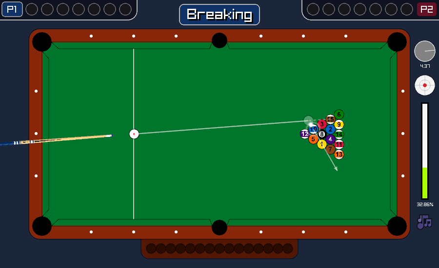
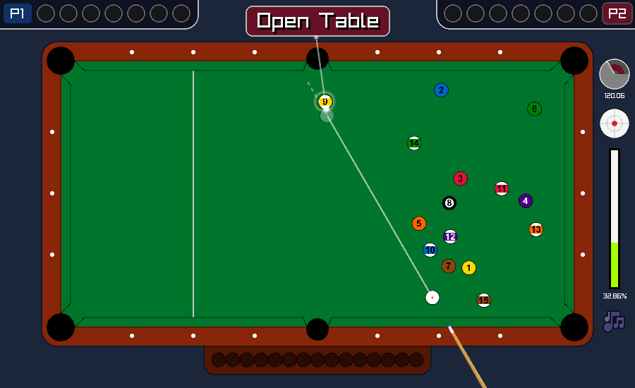
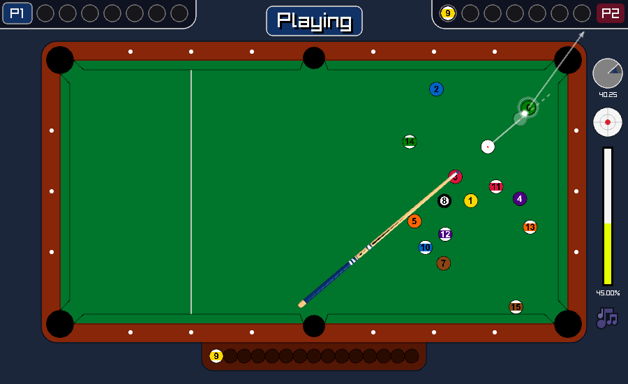

# 🎱 8 Ball Pool Game

A realistic 8 Ball Pool simulation game developed in C using the Raylib library. Features accurate physics, official game rules, and an intuitive interface.

## 🎮 Features

- **Realistic Physics Engine**
  - Ball-to-ball collision with momentum transfer
  - Ball-to-cushion collision with proper reflection
  - Friction and elasticity simulation
  - Spin mechanics (top, back, and side spin)
  - Continuous collision detection to prevent tunneling

- **Official 8 Ball Pool Rules**
  - Breaking validation
  - Open table mechanics
  - Group assignment (solids vs. stripes)
  - Ball in hand on fouls
  - Legal 8-ball pocketing conditions
  - Win/loss detection

- **Intelligent Trajectory Prediction**
  - Visual cue ball path
  - Impact point indication
  - Target ball trajectory preview
  - Ball number identification

- **Professional Interface**
  - Real-time power adjustment
  - Angle indicator
  - Hit point control (spin adjustment)
  - Score tracking
  - Game state display
  - Background music with toggle

## 🕹️ Controls

| Input | Action |
|-------|--------|
| **Mouse Movement** | Aim cue stick |
| **Mouse Wheel** | Adjust shot power |
| **Left Click** | Shoot |
| **Right Click + Drag** | Move balls (free positioning) |
| **Arrow Keys** | Adjust hit point (apply spin) |
| **Space** | Reset hit point to center |
| **R** | Restart game |
| **M** | Toggle background music |
| **S** | Stop all balls immediately |
| **F2** | Toggle help screen |

## 📋 Game Rules

1. **Breaking**: First player must hit the rack. At least 4 balls must touch cushions OR at least 1 ball must be pocketed for a valid break.

2. **Open Table**: After the break, the table is "open" until a player legally pockets a ball, which assigns them to either solids (1-7) or stripes (9-15).

3. **Playing**: Players must hit their assigned group first. Pocketing a ball legally grants another turn.

4. **Fouls**: Result in "ball in hand" for the opponent:
   - Not hitting any ball
   - Pocketing the cue ball
   - Hitting opponent's ball first
   - Neither cushion hit nor ball pocketed after contact

5. **Winning**: Pocket all balls in your group, then legally pocket the 8-ball.

6. **Losing**: Pocket the 8-ball before clearing your group.

## 🛠️ Building from Source

### Prerequisites

- GCC compiler
- Raylib library (included in project)
- Make